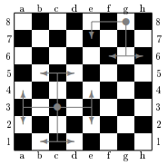

## 1. feladat (5 pont)

A feladat megállapítani, hogy egy huszár hány mezot üthet a sakktáblán. A huszár a tole L alakban egyenesen 2 oldalra 1 távolságra lévo mezoket üti (ahol az egyenes bármelyik irány lehet a 4 közül).



A függvény bemenetként karakterben kapja meg a mezu koordinátáit (egy kisbetu `a`-`h` és egy számjegy `1`-`8`), a visszatérési értéke pedig az ütött mezok száma.

Kódold le a függvényt C nyelven! A függvény fejlécén ne változtass! A függvény inputjai a paraméterek, outputja a visszatérési érték. A függvény nem végez IO muveleteket!

```c
int huszar(char oszlop, char sor);
```

## 2. feladat (5 pont)

Az alábbi függvény paramétere egy sztring. A feladat törölni belole minden második karaktert. (Ezáltal
a string rövidülhet.)

Kódold le a függvényt C nyelven! A függvény fejlécén ne változtass! A függvény inputjai a paraméterek,
outputja a visszatérési érték. A függvény nem végez IO muveleteket!

```c
void strtorles(char str[]);
```

## 3. feladat (5 pont)

Határozzuk meg, hogy a paraméterként kapott évben az adott hónap adott napja az év hányadik napja. A függvény ezzel az értékkel térjen vissza. Figyeljünk a szökoévekre! Az input adatok egy 1800 és 5000 közötti valós napot jelölnek.

Kódold le a függvényt C nyelven! A függvény fejlécén ne változtass! A függvény inputjai a paraméterek,
outputja a visszatérési érték. A függvény nem végez IO muveleteket!

```c
int evnapja(int ev, int ho, int nap);
```

## 4. feladat (5 pont)

Az alábbi függvény egy pénzösszeget kap paraméterként, majd meghatározza, hogy legkevesebb hány darab 10, 5, 2 és 1 koronás érmérvel fizetheto ki az összeg! A függvény visszatérési értéke -1, ha rossz értéket kap.

Kódold le a függvényt C nyelven! A függvény fejlécén ne változtass! A függvény inputjai a paraméterek,
outputja a visszatérési érték. A függvény nem végez IO muveleteket!

```c
int erme(int);
```

## Teszt

```ps
tcc -o bin.exe feladat.c
./bin -t 1
./bin -t 2
./bin -t 3
./bin -t 4
```

```ps
gcc -O2 -static -Wall -o feladat feladat.c
./feladat -t 1
./feladat -t 2
./feladat -t 3
./feladat -t 4
```
